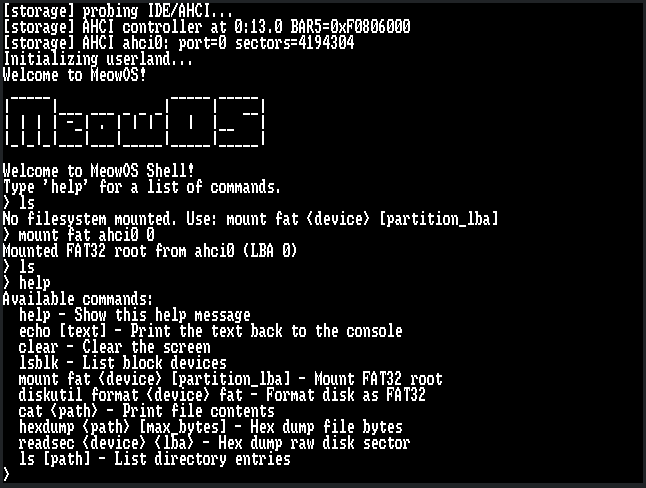

# MeowOS

## Hi! this is my another attempt to make a kernel in C! pull requests are welcome!!

### What we have:

- [x] working framebuffer
- [x] working shell
- [x] kind of working fat32 fs
- [ ] hope
- [ ] brain

### Here's a screenshot from one of the first versions!
